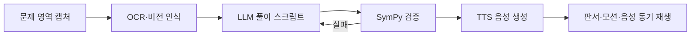
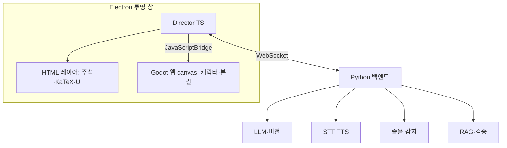
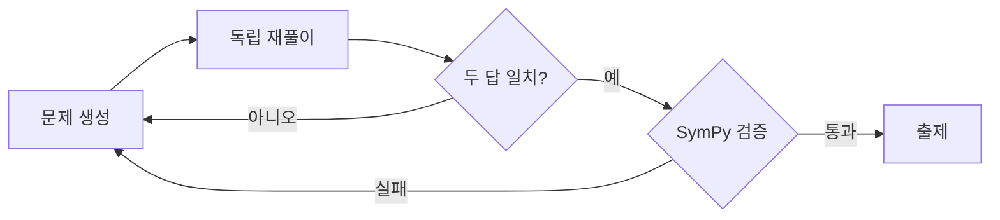
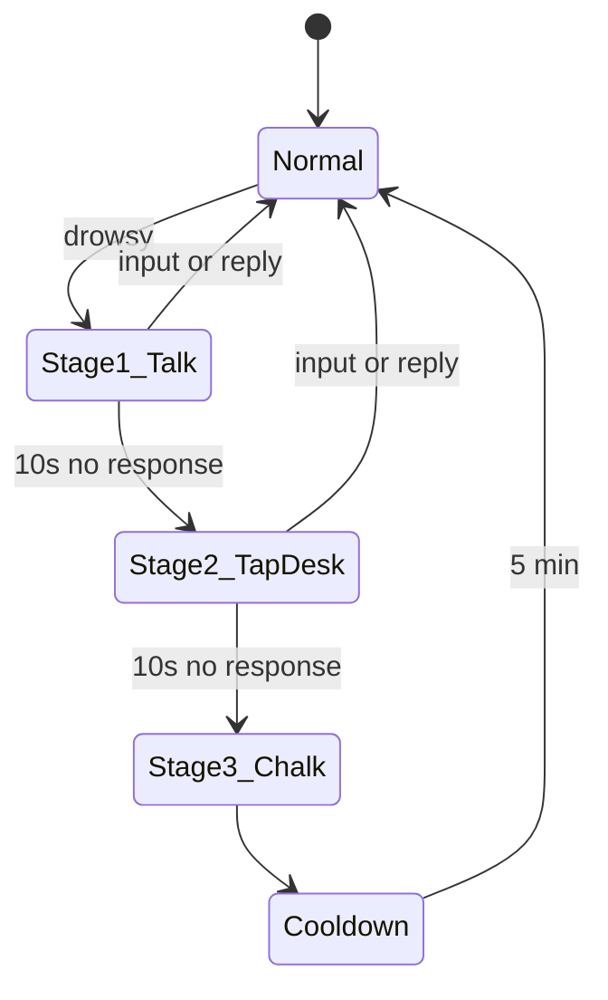

# StudyMate — 기획서 & 기술 스택

## 1. 개요

StudyMate는 모니터 위를 돌아다니는 3D 선생님 캐릭터가 문제를 내고, 풀이를 화면 위에 직접 판서하며 음성으로 설명하고, 졸면 분필을 던져 깨우는 로컬 AI 학습 도우미다. 모든 AI 추론은 사용자 PC 안에서 이루어지며, 외부 라이브러리는 무료이면서 상업적 이용이 가능한 것만 사용한다.

### 목표

- 풀이가 화면에 써지는 경험으로 텍스트 챗봇보다 이해도와 몰입도를 높인다
- 인터넷 없이 동작하고 카메라·학습 데이터가 PC 밖으로 나가지 않는다
- 캐릭터와의 상호작용(대화, 리액션, 깨우기)으로 공부 지속 시간을 늘린다

### 타깃 사용자

| 구분 | 설명 |
|---|---|
| 1차 | 혼자 공부하는 중고등학생, 수험생 (수학·과학 중심) |
| 2차 | 자격증·어학 등 문제 풀이형 학습을 하는 성인 |
| 3차 | 공부 방송·스터디윗미 스트리머 |

### 설계 원칙

1. **로컬 우선** — LLM, 음성, 비전, 졸음 감지를 모두 로컬에서 실행
2. **프라이버시** — 웹캠 옵트인, 프레임은 수치만 추출 후 즉시 폐기
3. **검증된 정답** — 수학 풀이와 출제 문제는 기호 계산으로 검증 후 표시
4. **라이선스 청정성** — MIT, Apache 2.0, BSD, SIL OFL, CC0만 사용. 모델 가중치 라이선스 별도 확인

## 2. 핵심 사용자 경험

**장면 A: 판서 풀이 (MVP 핵심).** 사용자가 단축키를 누르고 문제 영역을 드래그한다. 캐릭터가 문제 옆으로 걸어가 분필을 들고 설명하며 손을 움직이고, 그 동작에 맞춰 손글씨 수식과 화살표가 한 줄씩 그려진다.

**장면 B: 출제와 복습.** "3단원에서 5문제 내줘"라고 말하면 사용자 교재를 근거로 문제를 낸다. 틀린 문제는 오답노트에 쌓이고, 복습 시점에 캐릭터가 먼저 말을 건다.

**장면 C: 졸음 깨우기.** 눈이 오래 감기고 고개가 떨어지면 말 걸기 → 책상 두드리기 → 분필 투척 순으로 깨운다.

## 3. 기능 명세

P0 = MVP 필수, P1 = 정식 출시, P2 = 이후 확장

| 모듈 | 기능 | 우선순위 |
|---|---|---|
| 캐릭터 | 투명 오버레이 위 VRM 캐릭터, 걷기·대기·앉기 | P0 |
| 캐릭터 | 캐릭터 외 영역 클릭 통과, 드래그 이동 | P0 |
| 캐릭터 | 판서·가리키기·끄덕이기 제스처, 표정, 시선 추적 | P1 |
| 캐릭터 | 사용자 VRM 아바타 가져오기 (7.5), 라이선스 메타 표시 | P0 |
| 문제 인식 | 단축키 + 드래그 화면 캡처 | P0 |
| 문제 인식 | 텍스트 OCR, 수식 OCR(LaTeX) | P0 |
| 문제 인식 | 비전 LLM으로 그림·그래프 문제 이해 | P1 |
| 풀이 | 단계별 풀이 손글씨 애니메이션 | P0 |
| 풀이 | 수식 렌더링, 동그라미·화살표 마킹 | P0 |
| 풀이 | 판서 모션·음성·필기 타임라인 동기화 | P1 |
| 풀이 | SymPy 정답 검증, 확신도 표시 | P0 |
| 출제 | 과목·단원·난이도별 생성 (생성-재풀이-검증) | P1 |
| 출제 | 사용자 PDF·노트 기반 출제 (RAG) | P1 |
| 출제 | 오답 기반 유사 문제 | P2 |
| 음성 | TTS + 한글 모음 기반 립싱크 | P1 |
| 음성 | 언어별(한·일·영) 여성 목소리 여러 타입, 사용자 후보정(피치·속도·포먼트·EQ·리버브) 프리셋 (7.6) | P1 |
| 다국어 | 한국어·일본어·영어 UI, 캐릭터 말, 음성 인식, 나라별 교육과정 (7.8) | P1 |
| 음성 | 음성 질문 (VAD + STT), 푸시투토크 | P1 |
| 음성 | 호출어 | P2 |
| 졸음 감지 | PERCLOS·고개 숙임 판정 | P1 |
| 졸음 감지 | 3단계 깨우기, 민감도·강도 설정, 집중 모드 | P1 |
| 학습 관리 | 오답노트, FSRS 복습 | P1 |
| 학습 관리 | 공부 시간·정답률 통계 | P2 |
| 시스템 | 사양 감지 후 모델 티어 추천, 선택 다운로드 | P1 |
| 시스템 | 오픈소스 고지 화면 | P0 |

## 4. 시스템 아키텍처

기본안: **Godot 웹 익스포트를 Electron 투명 창 안에 넣는 단일 창 하이브리드.**

| 구성 요소 | 핵심 책임 |
|---|---|
| Electron 메인 | 투명·항상 위 창, 클릭 통과 토글, 화면 캡처, 트레이, 전역 단축키, 백엔드 프로세스 관리 |
| Electron 렌더러 | Director(타임라인), 주석 렌더링, 설정·채팅 UI, TTS 오디오 재생 |
| Godot 웹 빌드 | VRM 캐릭터, 애니메이션 상태 머신, IK, 분필 물리, 파티클 |
| Python 백엔드 | LLM·비전, OCR, 검증, STT·TTS, 졸음 판정, RAG, 학습 DB |

### 설계 규칙

- 지휘자는 Director 하나. Godot은 명령 수행 + 상태 보고만
- 오디오 재생 시각이 기준 시계
- 좌표는 창 기준 CSS 픽셀로 통일, 캡처 좌표만 DPI 변환
- 기본 클릭 통과, 캐릭터·UI 위에서만 입력 수신

### 대안 구조

| 안 | 구성 | 전환 조건 |
|---|---|---|
| 기본안 | Godot 웹 익스포트 + Electron 단일 창 | Phase 0 검증 통과 |
| 대안 A | 네이티브 Godot 창 + Electron 창, WebSocket | 웹 빌드 품질 부족, C# 필요 |
| 대안 B | Electron + three.js + three-vrm 단독 | 투명 캔버스 불가, 웹 중심 팀 |

Director와 프로토콜을 전송 계층과 분리해 두면 대안 A 전환 시 브리지 호출부만 교체하면 된다.

## 5. 기술 스택

라이선스는 작성 시점 기준이며, 출시 전 최신 버전으로 재확인한다.

### 앱 셸 · 프론트엔드

| 용도 | 선택 | 라이선스 |
|---|---|---|
| 데스크탑 셸 | Electron | MIT |
| 패키징 | electron-builder | MIT |
| 수식 렌더링 | KaTeX | MIT |
| 손그림 마킹 | Rough.js | MIT |
| 손글씨 폰트 | Nanum Pen Script | SIL OFL |
| UI 폰트 | Jua(제목), Pretendard(본문) | SIL OFL |
| 복습 스케줄 | py-fsrs (백엔드에서 계산, 셸은 표시만) | MIT |

### 3D 캐릭터

| 용도 | 선택 | 라이선스 |
|---|---|---|
| 엔진 | Godot 4 (웹 익스포트, Compatibility 렌더러, GDScript) | MIT |
| VRM | godot-vrm (런타임 로드는 확장을 first_priority로 등록) | MIT |
| 물리 | Godot 내장 | MIT |
| 대안 B | three.js + @pixiv/three-vrm + cannon-es | MIT |

### AI 백엔드

| 용도 | 선택 | 라이선스 |
|---|---|---|
| API 서버 | FastAPI + uvicorn | MIT / BSD |
| LLM 엔진 | llama.cpp llama-server (Vulkan 빌드, 외장 GPU 자동 선택 / CPU 빌드) | MIT |
| LLM | Qwen3 4B / 8B / 14B | Apache 2.0 |
| 비전 | Qwen2.5-VL 7B | Apache 2.0 |
| 텍스트 OCR | PaddleOCR 모델 (RapidOCR·ONNX Runtime으로 실행, PP-OCRv5 한국어) | Apache 2.0 |
| 수식 OCR | pix2tex | MIT |
| 검증 | SymPy | BSD |
| STT | faster-whisper + Whisper | MIT |
| VAD | Silero VAD | MIT |
| TTS | MeloTTS (KR) 추론 코드 발췌, BERT 없이 실행 (kykim BERT는 상업 MOU 필요) | MIT |
| 얼굴 추적 | MediaPipe Face Landmarker | Apache 2.0 |
| 영상 처리 | OpenCV 4.5+ | Apache 2.0 |
| 임베딩 | bge-m3 | MIT |
| 벡터 DB | sqlite-vec | MIT / Apache 2.0 |
| PDF | pypdfium2 | Apache 2.0 / BSD |
| 복습 | py-fsrs | MIT |
| 번들링 | 임베디드 CPython (python-build-standalone) — Nuitka는 torch 2.14 호환 문제로 보류 | PSF-2.0 / Apache 2.0 |

### 에셋

| 용도 | 방침 |
|---|---|
| 캐릭터 모델 | 기본 캐릭터는 번들 가능한 라이선스만 (7.5 후보 참고), VRoid Studio 자체 제작·외주는 상업·수정 권리 계약 명시. 사용자 아바타는 사용자가 직접 가져옴 (7.5) |
| 애니메이션 | 자체 제작 |
| 효과음 | Web Audio로 절차적 합성 (에셋 없음) |
| 음성 | 성우 계약 녹음 → TTS 학습, 합성 이용 범위 계약 명시 |

## 6. 사용 금지 · 주의 목록

| 항목 | 문제 | 대체 |
|---|---|---|
| Coqui XTTS | 모델 비상업(CPML) | MeloTTS |
| PyMuPDF | AGPL | pypdfium2, pdf.js |
| dlib 68점 모델 | 학습 데이터 비상업 | MediaPipe |
| Qwen2.5 3B·72B, Qwen2.5-VL 3B | 비 Apache | Qwen3, Qwen2.5-VL 7B |
| EXAONE | 비상업 | Qwen3 |
| Llama, Gemma | 자체 약관 | 검토 후 채택 |
| Mixamo | Adobe 약관, 재배포 불가 | 자체 제작 |
| 타인 VRM 모델 번들 | 모델별 이용조건, 대부분 재배포 불가 | 번들 금지. 사용자 가져오기(7.5)로만 허용 |
| Unity | 매출별 요금제 조건 | Godot |
| Piper 신규 | GPL-3.0 | MeloTTS, sherpa-onnx |

앱에 오픈소스 고지 화면을 두고 Apache 2.0 NOTICE를 포함한다.

## 7. 핵심 기능 상세 설계

### 7.1 풀이 스크립트와 판서

LLM은 JSON 스키마로 제약된 풀이 스크립트를 출력한다 (형식은 `PROTOCOL.md`의 `SolveScript`).

풀이는 정규 교육과정(중1~고1 수학) 교과서 방식을 따른다:

1. 문제를 먼저 단원으로 분류한다 (예 `중1 · 일차방정식`, JSON 스키마 enum). 단원마다 교과서 용어·풀이 순서·표기·자주 하는 실수·검산 방법을 담은 지도 지침(`solve/curriculum.py`)을 풀이 프롬프트에 넣는다
2. LLM 출력은 수업 흐름 칸으로 고정한다: `intro`(문제 파악, 문제 식) → `concept`(핵심 개념) → `solve`(1~8줄, 한 줄에 한 변형, 줄마다 옆 메모 `note`) → `check`(대입 검산) → `summary`(한 줄 정리). 칸이 고정이라 풀이가 길어도 검산·정리가 빠지지 않는다
3. SymPy는 `solve` 줄만 원래 문제와 동치인지 검증한다 (개념·검산·정리 줄은 동치식이 아니므로 제외)
4. 지시가 없는 식은 억지로 변형하지 않는다. 더 간단히 할 수 없으면 그 이유를 설명한다

재생 순서:

1. 모든 step의 `say`를 TTS로 미리 합성해 음성 길이를 얻는다
2. 보드를 문제 영역 오른쪽 또는 아래에 배치하고 캐릭터를 그 옆으로 이동
3. step마다 음성 재생과 동시에 판서 제스처 시작. KaTeX로 조판한 수식을 손글씨 폰트(나눔손글씨 펜)와 분필 질감 필터로 그리고, 글자 하나씩 드러낸다 (속도 = 음성 길이 기준)
4. 캐릭터 손 좌표를 매 프레임 받아 IK 목표점 = 필기 선두로 맞춤. 팔이 닿지 않으면 필기 선두를 따라 걷는다

보드:

- 문제 줄과 풀이 줄은 `=`를 한 열로 맞춘다. 줄 옆에 선생님 메모(`-5 이항`, `양변 ÷ 2`), 개념 줄은 점선 상자, 검산 줄은 ✓, 정리 줄은 밑줄
- 머리를 끌어 옮길 수 있다. ×로 닫으면 설명도 멈춘다
- 💬 또는 질문 패널로 방금 푼 문제에 대해 추가 질문할 수 있다 (문제·답·풀이가 `ask_request.context`로 30분간 유지). 식이 있는 답은 같은 보드의 풀이 아래 `Q.` 구분선 뒤에 쓴다

### 7.2 정답 검증과 출제

- 생성과 재풀이는 별도 컨텍스트로 호출, 재시도 최대 3회
- 확신도: SymPy 검증 통과 `high`, 기호 검증은 불가하지만 독립 재풀이 답이 일치 `medium`, 둘 다 아니면 `low` (PROTOCOL.md와 동일)
- 풀이 재시도는 매번 새 컨텍스트에서 하고, 틀린 줄 번호와 SymPy가 계산한 다음 줄·정답을 힌트로 준다 (자기 오답 복사 방지)
- RAG 출제 시 근거 문단을 함께 저장

### 7.3 졸음 감지

EAR = (‖p2 − p6‖ + ‖p3 − p5‖) / (2 · ‖p1 − p4‖)

초기 판정 규칙 (설정으로 조정 가능):

- 시작 시 5초간 뜬 눈 EAR 측정 → 개인 기준값, 기준값의 70% 미만 = 눈 감김
- 최근 30초 PERCLOS ≥ 40% 이고 고개 pitch 반복 하강 → 졸음 후보
- 최근 10초 내 키보드·마우스·펜 입력 있으면 판정 보류
- 처리 10~15 fps

분필: Godot 물리로 손 → 카메라 방향 포물선, 충돌 시 가루 파티클 + 창 흔들림 + 효과음. 강도 3단계(부드럽게/보통/교탁 모드).

### 7.4 립싱크

TTS 텍스트를 음절로 분해해 중성(모음)을 VRM 입모양에 매핑하고, 음성 RMS로 세기를 곱한다. 음소 타이밍이 없으면 음성 길이를 음절 수로 균등 분배.

| 입모양 | 모음 |
|---|---|
| aa | ㅏ ㅑ ㅘ |
| ih | ㅣ ㅟ ㅢ |
| ou | ㅜ ㅠ ㅡ |
| ee | ㅔ ㅐ ㅖ ㅒ ㅞ ㅙ |
| oh | ㅗ ㅛ ㅓ ㅕ ㅝ ㅚ |

### 7.5 아바타: 기본 캐릭터 + 사용자 VRM 가져오기

앱은 번들 가능한 **기본 캐릭터 하나만** 포함한다. BOOTH 등에서 구매·다운로드한 아바타는 사용자가 직접 가져온다 (VSeeFace 방식).

- 형식: **VRM 0.x / 1.0만** 지원. BOOTH의 VRChat 아바타는 대개 `.unitypackage`(FBX + lilToon/Poiyomi)이므로, 사용자가 Unity + UniVRM으로 VRM 변환 후 가져온다 (변환 가이드 문서 제공 예정). VRM 동봉 상품은 바로 사용 가능
- 흐름: 트레이 "아바타 불러오기" → 파일 선택 → `%APPDATA%/StudyMate/avatars/<sha256 앞 16자>.vrm`에 복사 → 렌더러가 `Engine.copyToFS`로 Godot 가상 FS에 기록 → `load_avatar` 명령 → Godot가 godot-vrm으로 런타임 로드
- 애니메이션: 휴머노이드 본에 절차적 포즈(대기·걷기)를 적용하므로 아바타별 애니메이션 에셋이 필요 없다. 이후 제스처도 휴머노이드 본 기준으로 만든다
- 라이선스 고지: 로드 시 VRM 메타(제작자, 라이선스, 상업 이용, 재배포)를 알림으로 보여주고, "이용 조건은 제작자 라이선스를 따르며 파일은 이 PC에만 저장" 문구를 표시한다. 앱은 사용자 아바타를 업로드·재배포하지 않는다
- 성인용 아바타 차단: 등록할 때 VRM(glTF) JSON을 읽어 제목·라이선스 메모·파일 이름의 성인 표기(R18, NSFW, 成人向け 등)와 파츠 이름의 신체 부위(유두·성기 메시, 셰이프 키 등)를 검사해 해당하면 등록을 거부한다 (`apps/shell/src/main/avatar-screening.ts`). 이미 선택된 아바타도 시작할 때 다시 검사한다. VRM 메타의 "성적 이용 허가" 플래그는 제작자의 허락일 뿐 내용물 표시가 아니므로 쓰지 않는다 (공식 츠쿠요미짱 모델도 Allow)
- 런타임 로드 주의: Godot 4.7 런타임에서는 내장 `ConvertImporterMesh` 확장이 `_import_post`에서 ImporterMeshInstance3D를 해제하므로, godot-vrm 확장은 `first_priority`로 등록해 먼저 실행해야 한다 (`avatar_loader.gd`)

기본 캐릭터 후보 (2026-09-25 조사, 유료 앱 번들 기준):

| 후보 | 형식 | 판정 | 비고 |
|---|---|---|---|
| VRoid CC0 샘플 (센다가야 시노, β AvatarSample_1~4, 사쿠라다 후미리야) | VRM 0.0 | 번들 가능 | CC0, 개조·개명 자유. 자체 선생님 캐릭터 베이스로 최적 |
| 츠쿠요미짱 3D 타입A | VRM | 조건부 가능 | 유료 소프트 수록 명시 허용. 크레딧 필수, 다른 캐릭터로 개조 금지, 약관 승계, 정치·종교 발화 금지 |
| Seed-san (VirtualCast) | VRM 1.0/0.x | 번들 가능 | 크레딧 필요, SF풍 외형 |
| VRoid AvatarSample_A/B/C | VRM 0.0 | 조건부 | "유상 재배포" 금지 조항, 유료 번들은 pixiv 문의 필요 |
| 니코니 입체짱, 미라이 코마치, 즌다몬, Mixamo, Sketchfab Standard, BOOTH VN3 무료 아바타 대부분 | - | 번들 불가 | 사용자 가져오기로만 |

출처와 조항 원문 링크는 `docs/research/default-character.md`에 둔다. 최종 선택은 사용자가 결정.

### 7.6 음성 캐릭터와 사용자 보정

- 언어마다 **여성** 목소리 여러 타입을 기본 제공한다 (2026-09-25 결정: 남성 목소리는 제공하지 않음). 목소리 목록은 현재 언어의 프리셋만 보여준다
- 한국어는 MeloTTS 한국어(BERT 없이, 여성 3타입), 일본어·영어는 Kokoro-82M(Apache-2.0)의 원어민 여성 화자(언어별 4타입)를 쓴다. 일본어 읽기는 pyopenjtalk-plus, 영어는 misaki 사전 + spaCy + 자체 숫자·수식 읽기 (GPL/LGPL인 espeak-ng·phonemizer·num2words는 쓰지 않음). 라이선스는 `THIRD_PARTY_NOTICES.md`
- 사용자가 후보정으로 자신만의 목소리를 만들 수 있다: 피치, 속도, 포먼트(음색), 이퀄라이저(밝기), 리버브·공간감, 볼륨. 프리셋으로 저장·불러오기
- 보정 체인은 TTS 출력 이후 단계로 둬서 모델 교체와 무관하게 동작시킨다. 립싱크 타이밍은 속도 보정 후의 오디오 기준으로 다시 계산한다 (설계 규칙 2: 오디오가 기준 시계)
- 오픈 이슈: MeloTTS 한국어는 화자 1명뿐이다. 상업 이용 가능한 한국어 다화자 TTS 모델(또는 라이선스 청정한 음성 변환)을 조사해야 한다. 포먼트 보정 라이브러리도 라이선스 확인 필요 (WORLD 계열 BSD, pyworld MIT 후보)

### 7.7 아트 디렉션: 서브컬처

전체 톤은 **서브컬처(애니·게임) 감성**으로 통일한다.

- 캐릭터: 애니풍 VRM (MToon 셀 셰이딩 + 외곽선). 기본 플레이스홀더도 치비 비율, 큰 눈, 트윈테일, 외곽선으로 맞춤
- UI: 파스텔 팔레트(핑크·라벤더·민트), 두꺼운 부드러운 외곽선, 스티커형 오프셋 그림자, 둥근 모서리, 팝인 애니메이션, 게임식 말풍선(타이핑 효과)
- 대사: 캐릭터 말투는 친근한 존댓말 + 감탄사 ("으앗", "짠!")
- 폰트(SIL OFL, 번들 예정): UI 제목 Jua 계열, 본문 Pretendard, 판서 나눔손글씨 계열. 번들 전까지는 시스템 폰트 대체

### 7.8 다국어 (한국어·일본어·영어)

- 언어는 셸 설정 하나로 정한다 (기본값: OS 언어가 한국어면 ko, 일본어면 ja, 그 밖은 en). 셸은 `hello.lang`과 `set_language`로 백엔드에 알린다
- 바뀌는 것: UI 문자열, 캐릭터의 말(LLM 프롬프트·거절 문구·안전 규칙), TTS 목소리, 음성 인식 언어, 문제 풀이 교육과정
- 교육과정은 단원 id를 공유하고 나라별 문안을 둔다: 한국 2022 개정 교육과정, 일본 学習指導要領, 미국 Common Core (`solve/curriculum*.py`). 학년 표기와 풀이 관례가 나라마다 다르다 (예: 한국·일본은 이항, 미국은 "양변에 같은 연산")
- 답 해석과 채점은 세 언어 표현을 모두 받는다 (또는/または/or, 해가 없다/解なし/no solution, 정답은/答えは/the answer is)
- 폰트: 한국어·영어는 기존 폰트, 일본어는 SIL OFL 일본어 폰트를 추가로 번들한다
- 호칭: 사용자가 캐릭터가 자신을 부르는 호칭(이름, 선배, マスター 등)을 설정에서 정한다. `set_profile`로 백엔드에 보내면 20자 이내·글자만 허용하고, 성적·연인 호칭(여보, ダーリン, honey 등)·욕설은 거부한다 (`studymate/profile.py`). 정해진 호칭은 모든 캐릭터 프롬프트와 셸의 정해진 대사에 쓰인다

### 7.9 안전과 이용 목적

- 이용약관(EULA, `apps/shell/build/eula/`)은 지정된 학습 목적 외의 사용과 **성적인 목적의 사용**을 금지한다
- 동의는 앱을 **처음 실행할 때** 앱 안에서 받는다: 언어 선택 → 약관 전문 → (선택) 호칭 → 받을 모델 요약 → "동의하고 설치 시작". 동의 전에는 모델을 받지 않고 AI 기능도 막는다. 거절하면 앱을 끈다. 약관 버전이 바뀌면 다시 묻는다. 설치 파일(NSIS)에는 약관 페이지를 두지 않는다 (Steam 빌드와 같은 흐름, 이중 동의 방지). 크레딧 화면에서 다시 볼 수 있다
- 캐릭터 발화 안전 장치: 모든 프롬프트에 안전 규칙, 성적 요청은 모델 실행 전에 거절, 모든 출력(말·판서·메모)을 세 언어 패턴으로 필터링 (`solve/safety.py`). 교육 용어(생식, 性教育, sexual reproduction, naked eye 등)는 막지 않도록 테스트로 고정
- 성인용 아바타는 등록을 거부한다 (7.5)
- Steam 출시 자료(AI 생성 콘텐츠 공개 문안, 개인정보 문안, SteamPipe 빌드)는 `docs/steam/README.md`

### 7.10 수능 전 과목 풀이

목표: 대한민국 수능 과목(국어, 수학, 영어, 한국사, 사회탐구, 과학탐구)의 문제를 모두 판서 수업으로 풀이한다.

- 분류 2단계: 과목(math·korean·english·korean_history·social·science·other) → 그 과목의 단원/유형. 수학은 중1~고1 + 수능 수학(수학Ⅰ·Ⅱ, 확률과 통계, 미적분, 기하), 나머지는 `solve/curriculum_csat.py`의 과목·유형별 풀이 전략(국어 독서·문학·화작·언매, 영어 유형 10종, 한국사, 사탐 6묶음, 과탐 4과목)
- 수업 형식
  - 수학: 문제 → 개념 → 풀이(식 변형) → 검산 → 정리. SymPy로 검증되면 `high`
  - 그 밖의 과목: 문제(발문 요약) → 유형 전략(답 비공개) → 근거와 선택지 판단(○/×) → 확인(헷갈리는 오답) → 정리. SymPy 검증이 없으므로 **독립 재풀이 다수결**로 `medium`을 준다 (5지선다는 처음부터 재풀이 2회, 판서가 ○로 표시한 선택지와 최종 답이 같아야 하고, 답이 하나여야 한다)
- 어려운 문제(수능 수학, 비수학 전 과목)는 LLM 출력 앞에 보이지 않는 `analysis` 칸을 두어 먼저 끝까지 풀고, 최종 답 → 판서 순으로 쓴다 (JSON 스키마 안의 칸, 학생에게 보이거나 읽히지 않음)
- 긴 지문: 언어 모델 문맥 16k(q8_0 KV), 비전 12k, 지문 받아쓰기 6,000자까지
- 풀 문제가 없는 입력(답만, 단원 제목, 메뉴 글자)은 과목 분류에서 `none`으로 걸러 수업을 만들지 않고 `no_problem` 오류로 다시 잘라 달라고 안내한다
- 고등·수능 수학 단원은 수업 전에 추론(thinking) 모드로 먼저 푼다 (`solve.think`, GPU에서만, 추론 토큰 상한 `llama.reasoning_budget`). 수업은 그 풀이 요약을 따라 쓰고, 추론 답은 재풀이 투표 한 표. 빠른 재풀이와 어긋나도 추론 답과 수업이 같으면 재시도하지 않고 `low`(확인 필요)로 보여 준다
- 학생이 "정답은 ③"처럼 답을 바로잡으면 (`ask_request.problem_id`) 문제 원문으로 다시 풀어 틀린 곳을 인정하고 정답을 설명한다. 정답지가 틀렸다고 말하지 않는다. 수학은 SymPy로 학생 답을 먼저 확인한다
- 평가: `eval/run_csat.py`(비수학 79문항, 직접 작성한 수능형 문항), `eval/run_eval.py --set csat-math`(수능 수학). 기출 문항은 저작권 때문에 쓰지 않는다

## 8. 권장 사양 티어

4비트 양자화 기준 추정치, 실측 후 확정.

| 티어 | 대상 PC | LLM | 비전 | STT | 모델 용량 |
|---|---|---|---|---|---|
| Lite | 내장 그래픽, RAM 16GB | Qwen3 4B (CPU) | 없음, OCR만 | Whisper small | 약 4GB |
| Standard | VRAM 8GB, RAM 16GB | Qwen3 8B | Qwen2.5-VL 7B 온디맨드 | Whisper medium | 약 12GB |
| Pro | VRAM 12GB+, RAM 32GB | Qwen3 8B+ 상시 | Qwen2.5-VL 7B 상시 | Whisper large-v3 | 15GB+ |
| Max | VRAM 16GB+, RAM 32GB | Qwen3 14B | Qwen2.5-VL 7B (16GB 카드는 언어 모델과 번갈아 적재) | Whisper large-v3 | 약 19GB |

졸음 감지와 TTS는 모든 티어에서 CPU로 동작.

GPU 메모리: 역할(언어·비전·임베딩)별 llama-server가 필요할 때 뜨고, 새 모델이 이미 올라간 모델들과 함께 들어가지 않으면 가장 오래 안 쓴 다른 역할을 (진행 중인 요청이 끝난 뒤) 내린다 (`llm/server.py`, 예산은 첫 실행 때 남아 있던 VRAM − 512MB). RTX 5080 실측: 14B 대화 9.7GB, 비전(1920px 화면) 6.7GB, 8B 대화 4.9GB, 임베딩 0.4GB.

삭제: 모델(`%APPDATA%/StudyMate/models`)은 설치 폴더 밖에 있어 업데이트 때 지워지지 않는다. 설치본 제거 프로그램(`build/installer.nsh`)과 Steam 제거(`steam/installscript.vdf` → `--uninstall-cleanup`)는 모델과 학습 기록·설정까지 지울지 한 번 묻는다.

## 9. 로드맵

| 단계 | 기간 | 목표 | 완료 기준 |
|---|---|---|---|
| 0. 기술 검증 | 2주 | Godot 웹 빌드 투명 임베드, VRM, 클릭 통과 | 바탕화면 위 60fps 걷기, 빈 영역 클릭 통과 |
| 1. MVP | 6주 | 캡처 → OCR → 풀이 → 검증 → 손글씨 주석 | 중학 수학 방정식 50문항 중 45+ 정답 |
| 2. 음성·동기화 | 5주 | TTS·립싱크, 판서 IK, 타임라인, STT | 음성-필기 오차 100ms 이내 |
| 3. 출제·졸음 | 5주 | 출제 파이프라인, RAG, 3단계 깨우기 | 졸음 오탐 시간당 1회 이하 |
| 4. 출시 준비 | 4주 | 오답노트·FSRS, 티어 설정, 다운로더, 설치 패키지 | 클린 PC 설치~첫 풀이 10분 이내 |

## 10. 리스크와 대응

| 리스크 | 대응 |
|---|---|
| Godot 웹 빌드 투명 배경 불가·성능 부족 | Phase 0 검증, 실패 시 대안 B |
| 로컬 LLM 수학 오답 | SymPy 검증, 재풀이 교차 확인, 확신도 표시 |
| 졸음 오탐 | 3단계 깨우기, 입력 활동 보류, 개인 보정, 민감도 |
| 설치 용량 과다 | 티어별 선택 다운로드, 이어받기 |
| VRAM 부족 | TTS·졸음 CPU, 비전 온디맨드 |
| 라이선스 변경 | 버전 고정, 출시 전 재검토, 라이선스 스캐너 CI |
| 웹캠 거부감 | 옵트인, 트레이 표시, 처리 방식 공개 |

### 오픈 이슈

- [x] Godot 웹 익스포트 투명 캔버스 동작 여부 (Phase 0) → 동작 확인 (`docs/phase0-report.md`)
- [ ] 기본 캐릭터 최종 선택 (7.5 후보)
- [ ] 상업 이용 가능한 한국어 다화자 TTS / 음성 보정 방식 (7.6)
- [ ] MeloTTS 한국어 품질, 파인튜닝 녹음 분량
- [ ] 멀티 모니터 이동 방식 (전체 영역 창 vs 모니터별 창)
- [ ] 수학 외 과목 출제 검증 방식
- [ ] macOS 지원 시점
- [ ] 수익 모델
